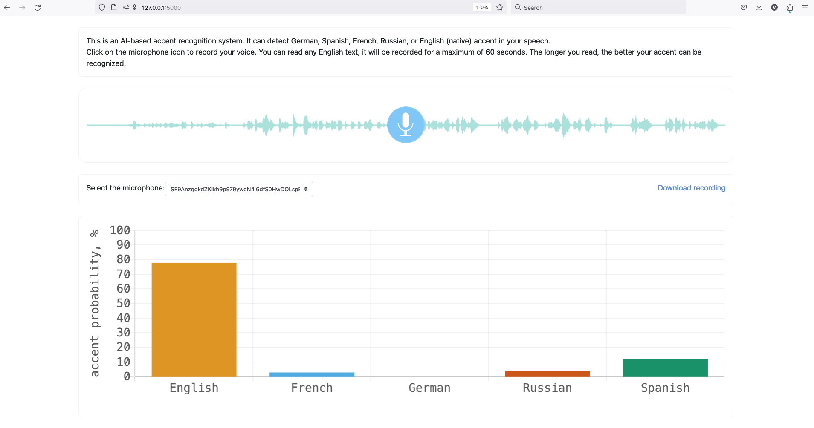

# English accent recognition

This is a ML-based flask application to distinguish between German, Russian, Spanish, French, and English (native) accents in English.

The inference is performed on an ensemble of 10 attention RNN models, fine-tuned on [Speech Accent Archive](https://accent.gmu.edu/) after pre-training on the [MCV dataset](https://commonvoice.mozilla.org/en/datasets).
More details about model training on MCV can be found [here](https://medium.com/towards-data-science/spoken-language-recognition-on-mozilla-common-voice-part-i-3f5400bbbcd8) and [here](https://medium.com/towards-data-science/spoken-language-recognition-on-mozilla-common-voice-part-ii-models-b32780ea1ee4).

# Installation

The required dependecies can be installed via [conda](https://docs.conda.io/projects/conda/en/latest/user-guide/install/index.html):

```
conda env create -f environment.yml
conda activate accents
```

Depending on you system, you may need a different way to install Pytorch v. 1.13.0, see [the official documentation](https://pytorch.org/get-started/previous-versions/).

Apple Mac M1 users may also experience a problem with loading the libsndfile.dylib library. The remedy is to update conda, then run `brew install libsndfile`.

After installation, the flask application can be launched with `flask run`. The application is then available at `http://127.0.0.1:5000` in your browser.


